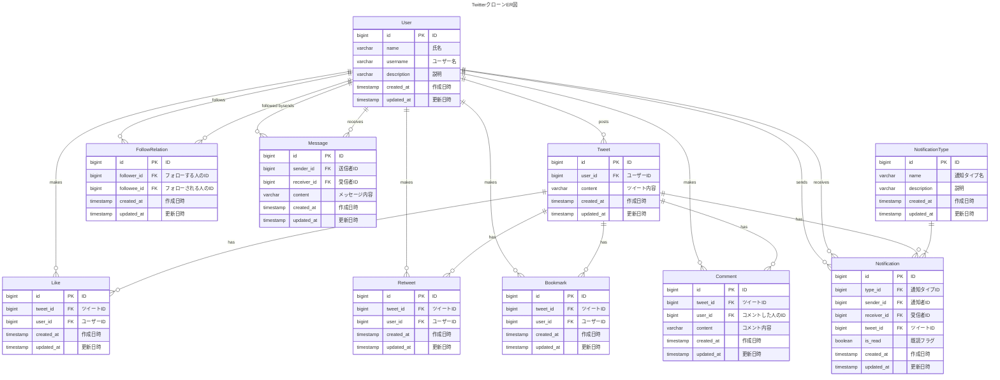

# Twitterクローンアプリ（Django × Docker）

DjangoとDockerを活用して、Twitterの基本機能を再現したクローンアプリです。
ユーザー認証、ツイート、DM、通知などSNSに必要な主要機能を網羅しており、スクールの課題として設計・実装しました。

## 🔧 使用技術
- **言語**：Python
- **フレームワーク**：Django
- **データベース**：PostgreSQL
- **画像ストレージ**：Cloudinary（ユーザーアイコンなどをアップロード）
- **開発環境**：Docker / Docker Compose
- **デプロイ**：Heroku

## 🔑 実装機能
- サインアップ・ログイン（GitHubログイン）
- ツイートの投稿・いいね・リツイート・ブックマーク
- ユーザーのフォロー
- ダイレクトメッセージ（DM）
- 通知（いいね、フォロー、DMなど）
- プロフィール編集

## 🗃️ テーブル設計

```mermaid
---
title: "TwitterクローンER図"
---
erDiagram
    User ||--o{ Tweet : "posts"
    User ||--o{ FollowRelation : "follows"
    User ||--o{ FollowRelation : "followed by"
    User ||--o{ Like : "makes"
    User ||--o{ Retweet : "makes"
    User ||--o{ Bookmark : "makes"
    User ||--o{ Comment : "makes"
    User ||--o{ Message : "sends"
    User ||--o{ Message : "receives"
    User ||--o{ Notification : "sends"
    User ||--o{ Notification : "receives"
    Tweet ||--o{ Like  : "has"
    Tweet ||--o{ Retweet  : "has"
    Tweet ||--o{ Bookmark  : "has"
    Tweet ||--o{ Comment  : "has"
    Tweet ||--o{ Notification : "has"
    NotificationType ||--|{ Notification : ""


    User {
        bigint id PK "ID"
        varchar name "氏名"
        varchar username "ユーザー名"
        varchar description "説明"
        timestamp created_at "作成日時"
        timestamp updated_at "更新日時"
    }

    FollowRelation {
        bigint id PK "ID"
        bigint follower_id FK "フォローする人のID"
        bigint followee_id FK "フォローされる人のID"
        timestamp created_at "作成日時"
        timestamp updated_at "更新日時"
    }

    Tweet {
        bigint id PK "ID"
        bigint user_id FK "ユーザーID"
        varchar content "ツイート内容"
        timestamp created_at "作成日時"
        timestamp updated_at "更新日時"
    }

    Like {
        bigint id PK "ID"
        bigint tweet_id FK "ツイートID"
        bigint user_id FK "ユーザーID"
        timestamp created_at "作成日時"
        timestamp updated_at "更新日時"
    }

    Retweet {
        bigint id PK "ID"
        bigint tweet_id FK "ツイートID"
        bigint user_id FK "ユーザーID"
        timestamp created_at "作成日時"
        timestamp updated_at "更新日時"
    }

    Comment {
        bigint id PK "ID"
        bigint tweet_id FK "ツイートID"
        bigint user_id FK "コメントした人のID"
        varchar content "コメント内容"
        timestamp created_at "作成日時"
        timestamp updated_at "更新日時"
    }

    Bookmark {
        bigint id PK "ID"
        bigint tweet_id FK "ツイートID"
        bigint user_id FK "ユーザーID"
        timestamp created_at "作成日時"
        timestamp updated_at "更新日時"
    }

    Message {
        bigint id PK "ID"
        bigint sender_id FK "送信者ID"
        bigint receiver_id FK "受信者ID"
        varchar content "メッセージ内容"
        timestamp created_at "作成日時"
        timestamp updated_at "更新日時"
    }

    Notification {
        bigint id PK "ID"
        bigint type_id FK "通知タイプID"
        bigint sender_id FK "通知者ID"
        bigint receiver_id FK "受信者ID"
        bigint tweet_id FK "ツイートID"
        boolean is_read "既読フラグ"
        timestamp created_at "作成日時"
        timestamp updated_at "更新日時"
    }

    NotificationType {
        bigint id PK "ID"
        varchar name "通知タイプ名"
        varchar description "説明"
        timestamp created_at "作成日時"
        timestamp updated_at "更新日時"
    }
```

## 学んだこと
- Djangoのクラスベースビューを用いて、MVT構造を意識した保守性の高いルーティングとロジック分離方法について学んだ。
- 外部ストレージとしてCloudinaryをアプリ連携する方法について学んだ。
- Herokuデプロイでは環境変数、PostgreSQLとの接続、静的ファイルの取り扱いを経験できた。
